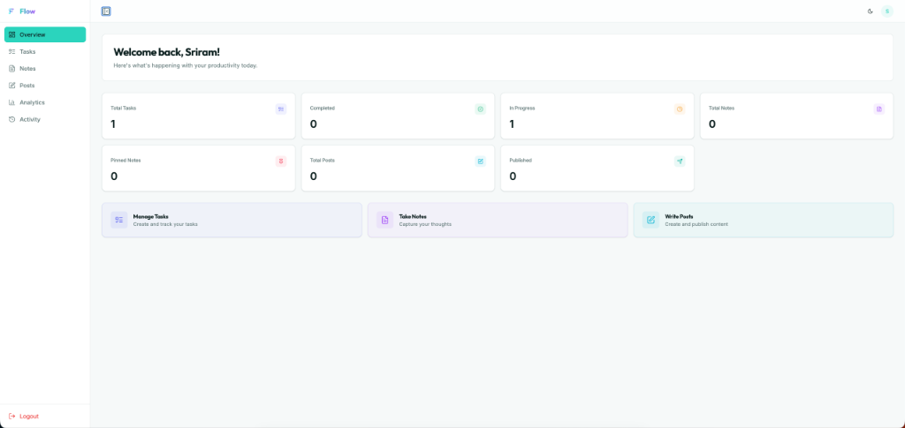
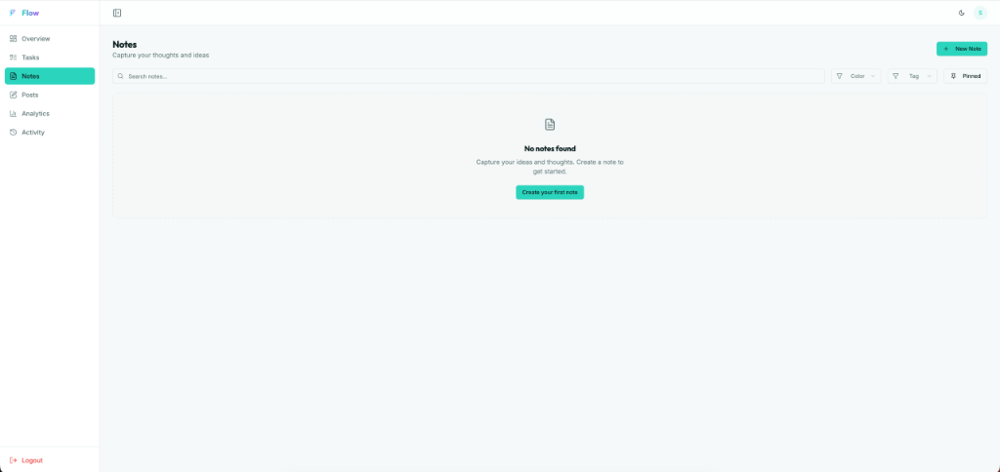
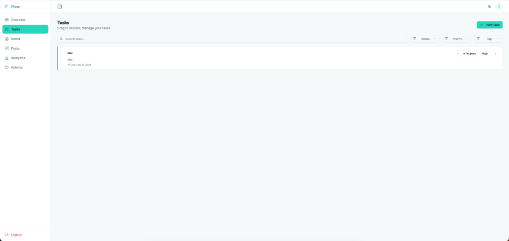

<div align="center">
  <h1>🌊 Flow</h1>
  <h3>The Ultimate Full-Stack Productivity Dashboard</h3>
  <p>Manage tasks, notes, and posts in one unified, beautiful interface.</p>

  <p>
    <a href="https://flow-app-zeta.vercel.app">
      
    </a>
  </p>

  <p>
    
    
    
    
    <br />
    
    
    
  </p>
</div>

<br />

## 📸 Screenshots



<p align="center">
  
  
</p>


<br />

## 🚀 Features

### Core Functionality

- 🔐 **Secure Auth**: JWT-based authentication with auto-refresh mechanism.
- 📊 **Dashboard**: Real-time overview of your productivity stats.
- ✅ **Task Management**: Create, filter, prioritize, and drag-and-drop reorder tasks.
- 📝 **Rich Notes**: Create and pin notes with a clean editor.
- ✍️ **Posts**: CMS-style post management with draft/publish states.
- 👤 **Profile**: Customizable user profiles with avatar uploads.

### Performance & Security

- 🛡️ **Rate Limiting**: API endpoints protected against abuse.
- ⚡ **Optimized Queries**: Dashboard stats aggregated efficiently (80% fewer queries).
- 📱 **Responsive**: Mobile-first design that works perfectly on all devices.
- 🌓 **Dark Mode**: Beautiful dark/light theme switching.

<br />

## 🏗️ Project Architecture

### High-Level Design

The application follows a modern **decoupled architecture**, separating the frontend user interface from the backend business logic.

- **Frontend (SPA)**: Built with **React**, communicating with the backend via RESTful APIs. It handles client-side routing, state management (Auth/Theme contexts), and UI interactivity.
- **Backend (REST API)**: Built with **FastAPI**, providing high-performance endpoints. It handles request validation (Pydantic), business logic, and database interactions (SQLAlchemy).
- **Database**: **PostgreSQL** (hosted on Supabase) serves as the persistent storage, fully normalized to support complex relationships (Users ↔ Tasks/Notes/Posts).

### Database Schema

The database is designed around the **User** entity, with all other entities having a foreign key relationship to the user.

- **Users**: Stores profile info and authentication credentials (hashed passwords).
- **Tasks**: Productivity items with status, priority, and due dates.
- **Notes**: Rich-text notes with color coding and pinning support.
- **Posts**: Content creation with draft/publish workflows.
- **Tags**: Many-to-Many relationships with Tasks, Notes, and Posts for categorization.
- **Activities**: Immutable log of user actions for the "Activity Timeline" feature.

### Authentication Flow

1. **Registration/Login**: User credentials are sent to `/api/auth/login`.
2. **Token Issuance**: Server validates credentials and returns an **Access Token** (short-lived) and **Refresh Token**.
3. **Requests**: Frontend attaches the Access Token to `Authorization: Bearer <token>` header.
4. **Auto-Refresh**: Axios interceptors automatically use the Refresh Token to get a new Access Token when the old one expires (401 Unauthorized), ensuring a seamless session.

<br />

## 🛠️ Tech Stack

### Backend

- **FastAPI**: High-performance async Python web framework.
- **Supabase (PostgreSQL)**: Scalable relational database.
- **SQLAlchemy (Async)**: Modern ORM for database interactions.
- **Alembic**: Database migration management.

### Frontend

- **React 19**: Latest React features with functional components.
- **Tailwind CSS**: Utility-first CSS framework for rapid UI development.
- **Recharts**: Composable charting library for analytics.
- **Lucide React**: Beautiful & consistent icon set.

<br />

## ⚡ Quick Start

### Backend

```bash
cd backend
python -m venv venv
source venv/bin/activate  # Windows: venv\Scripts\activate
pip install -r requirements.txt
uvicorn server:app --reload
```

### Frontend

```bash
cd frontend
npm install
npm start
```

<br />

## 📂 Project Structure

```bash
/
├── backend/          # FastAPI application
│   ├── routes/       # API endpoints
│   ├── models.py     # Database models
│   └── server.py     # Entry point
│
├── frontend/         # React application
│   ├── src/
│   │   ├── components/  # UI components
│   │   ├── pages/       # Route views
│   │   └── context/     # Global state
│
└── screenshots/      # Demo images
```

<br />

## 📚 API Reference

### Data Models

| Model    | Key Fields                                                                                   | Description                              |
| :------- | :------------------------------------------------------------------------------------------- | :--------------------------------------- |
| **User** | `id`, `email`, `full_name`, `avatar_url`                                                     | System user with authentication details. |
| **Task** | `title`, `status` (todo, in_progress, completed), `priority` (low, medium, high), `due_date` | Work item to be tracked.                 |
| **Note** | `title`, `content`, `is_pinned`, `color`                                                     | Free-form text note.                     |
| **Post** | `title`, `content`, `is_published`                                                           | Content piece with lifecycle management. |

### Endpoints

| Method    | Endpoint             | Description                   |
| :-------- | :------------------- | :---------------------------- |
| **Auth**  |                      |                               |
| `POST`    | `/api/auth/register` | Register new user.            |
| `POST`    | `/api/auth/login`    | Authenticate and get tokens.  |
| `POST`    | `/api/auth/refresh`  | Refresh expired access token. |
| **Tasks** |                      |                               |
| `GET`     | `/api/tasks`         | Get all tasks (filterable).   |
| `POST`    | `/api/tasks`         | Create a new task.            |
| `PUT`     | `/api/tasks/:id`     | Update task details/status.   |
| `DELETE`  | `/api/tasks/:id`     | Remove a task.                |
| **Notes** |                      |                               |
| `GET`     | `/api/notes`         | Get all notes.                |
| `POST`    | `/api/notes`         | Create a note.                |
| **Posts** |                      |                               |
| `GET`     | `/api/posts`         | Get all posts.                |
| `POST`    | `/api/posts`         | Create a post.                |

<br />

---

<p align="center">
  Made with ❤️ by <strong>Sriram Naidu</strong> for the Full Stack Assignment.
</p>
